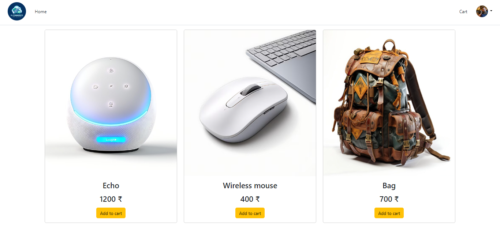

# BestBags

## Table of contents

- [Introduction](#introduction)
- [Demo](#demo)
- [Database Models](#database)
- [Run](#run)
- [Technology](#technology)
- [Features](#features)
- [Install Dependencies](#Install)


## Introduction

A virtual ecommerce website using Node js, Express js, and Mongoose.

NOTE: Please read the RUN section before opening an issue.

## Demo



The website resembles a real store and you can add products to your cart and pay for them. If you want to try the checkout process, you can use the dummy card number for testing. Please <u><b>DO NOT</b></u> provide real card number and data.

In order to access the admin panel on "/admin" you need to provide the admin email and password.

## Install Dependencies

```bash
npm install 
```

## Run

```bash
npx nodemon
```

To run this application, you have to set your own environmental variables. For security reasons, some variables have been hidden from view and used as environmental variables with the help of dotenv package. Below are the variables that you need to set in order to run the application:

- MONGO_URI: this is the connection string of your MongoDB Atlas database.

- SESSION_SECRET: a secret message for the session. You can use any string here.

- ADMIN_Username, ADMIN_Password: the username and password used to log into the admin panel using /Admin. You can put username(admin) and password(admin) here.

Now you can run "npx nodemon" in the terminal and the application should work.

## Technology

The application is built with:

- Node.js version 21.7.1
- MongoDB version 8.5.1
- Express version 4.19.2
- Bootstrap version 5.3.3

## Features

The application displays a virtual bags store that contains virtual products and contact information.

Users can do the following:

- Create an account, login or logout
- Browse available products added by the admin
- Add products to the shopping cart
- Delete products from the shopping cart
- Display the shopping cart
- The profile contains all the orders a user has made

Admins can do the following:

- Login or logout to the admin panel
- View all the information stored in the database. They can view/add/edit/delete orders, users, products and categories.

## Database

All the models can be found in the models directory created using mongoose.

### Admin Schema:

- Username (String)
- Password (String)

### User Schema:

- Username (String)
- Email (String)
- Password (String)

### Product Schema:

-  Title (String)
-  Image String
-  Price (Number)
-  Description (String)

### Order Schema:

-  Username (String)
-  FirstName (String)
-  LastName (String)
-  Email (String)
-  Phone (Number)
-  Address (String)
-  State (String)
-  Addinfo (String)
-  Products (Array)
-  total (Number)

- Copyright 2024 © [Raish Mohammad](https://github.com/nawab1609)
